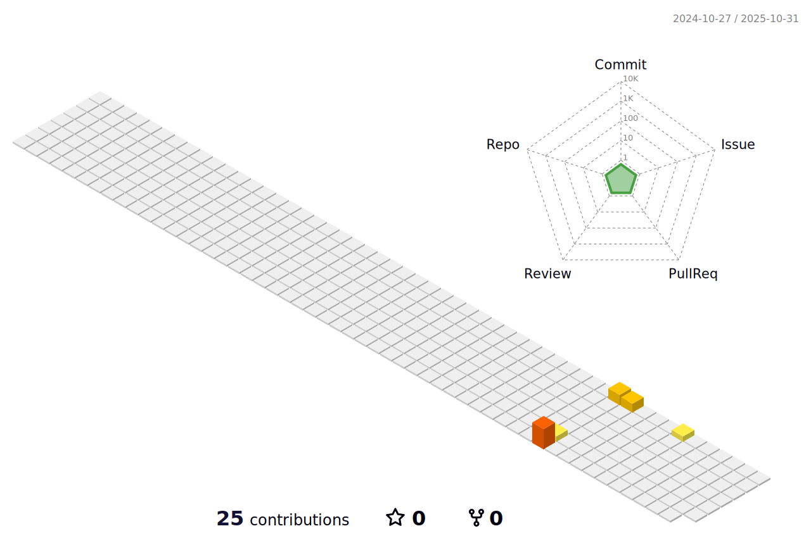

<h1 align="center">
    
</h1>

<h3 align="center">A software developer from Bangladesh 🇧🇩</h3>

 

 
 🔭 I’m currently working at **WIB Corporation**
 
 🌱 I’m currently learning **Django**

💬 Ask me about **Java, Koltin, Docker,Kubernetes... or anything**

<!--⚡ Fun fact **Game of Thrones Night's Watch cloaks are made from Ikea rugs**-->

 

 

 
  
  
   <!-- sqlite, safari, google-chrome are other good icon options -->
  </a>

 

 
<h2 align="center">⚒️ Languages-Frameworks-Tools ⚒️</h2>
 

    
     
    
     

 

<!--

  <h2>🐍 My Contributions 🐍</h2>
   
  
  
     

-->

<!--

<h2 align="center">⚡ Stats ⚡</h2>
 

  
  
   
  

  

 

 

-->

### 📢 Find me elsewhere

  <!--&nbsp;&nbsp;&nbsp;-->
  
  &nbsp;&nbsp;&nbsp;

  &nbsp;&nbsp;&nbsp;

  <a href="https://www.hackerrank.com/karar_rifat">
    Code Forces</a> by <a href="https://iconscout.com/contributors/icon-54" class="text-underline font-size-sm" target="_blank">Icon 54</a>" alt="hackerrank" style="vertical-align:top; margin:4px">
  </a>&nbsp;&nbsp;&nbsp;
  
  <!-- &nbsp;&nbsp;&nbsp;-->

<!---->

